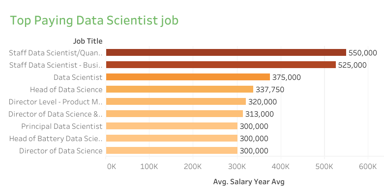
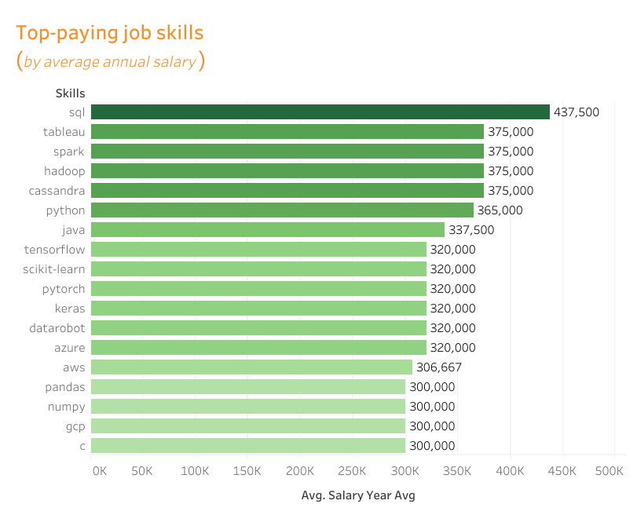
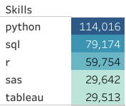

# Introduction
📊The project delves into the realm of data science job market leveraging the power of SQL to extract actionable insight from a rich dataset encompassing a myriad of job postings. It aims to unravel the top paying jobs, top paying job skills, in demand skills and where high demand meets high salary in data scientist role.

🔍SQL queries? Check them out here:
[project_sql folder](/project_sql/)

#  Background
Driven by the quest to navigate the Data scientist job market effectively. The aim of this project was to pinpoint the top paying job in data science job market and valuable skills required for the job roles and provide insight on the ones in high demand and with lucrative salaries.

Data source is from a tutor [SQl tutorial](https://lukeb.co/sql_project_csvs). It's a rich dataset with insight on job titles, job location, average salary, job posted date, essential skills and companies. 

# Tool I used
To work on this project I harnessed the power of several tools:

**SQL**: The backbone of my analysis allowing me to query the database and unravel actionable insights.

**PostgreSQL**: The ideal database management system I chose for handling job postings dataset.

**Visual studio code**: My preferred databse management and executing SQL queries.

**Git and GitHub**: Essential platform for storing, manage and share repositories of my work and allows issue tracking, code review, pull request and project management.

**Tableau**: Data visualization tool which was very useful in this project. 

# The Analysis
This part displays the queries that addresses the questions of this project aiming at investigating specific aspects of data scientist job market. Here's how i approached the questions.

### 1. Top paying Data Scientist jobs
To identify the top paying data scientist jobs💼, I filtered Data scientist role from the dataset, positioned it with average yearly salary and location, focusing on the job work from home (remote).
The idea is to determine which Data scientist role earns highest average yearly salary compared to others. Here is the queries.

 ```sql
 SELECT
    job_id,
    job_title,
    job_schedule_type,
    job_location,
    salary_year_avg,
    job_posted_date,
    name AS company_name

FROM
     job_postings_fact
LEFT JOIN company_dim ON company_dim.company_id = job_postings_fact.company_id
WHERE job_title_short = 'Data Scientist' AND
    job_location = 'Anywhere' AND
    salary_year_avg IS NOT NULL
ORDER BY
    salary_year_avg DESC
LIMIT 10;
```
Here is the breakdown of the top data scientist jobs in the year 2023.

**Salary range**: The top data scientist role span from $300,000 to $550,000 average yearly salary, indicating a significant salary potential in this field.

**Location wise**: These jobs are offered anywhere, whether remote or onsite, which provide potenntial opportunities for those who prefers working remotely and not onsite.

**Diverse Employer**: The companies that are among those offering high salaries for these roles are like *Selby Jennings*, *Algo Capital Group*, *Demandbase*, *Reddit* and *Storm4*, which indicates that there is a broad interest across different industries.

**Job title variety**: There is a variety in job title, from Staff Data scientist/Quant researcher, Staff Data scientist/Business analytics, Head of Data scienc, Principal Data scientist among others. These shows that there are varied specialization roles within Data scientist job. 


*Bar graph visualizing the salary for the top 10 data scientist; The graph was generated by Tableau from the SQL queries results.*

## 2. Top paying job skills
To investigate the top paying job skills I built a CTEs by conducting a left join of company_dim and job_postings_fact dataset. Later on, I join the CTEs with other two dataset(skills_job_dim & skills_dim) to provide detail for high paying skill required. This helps the job seeker to understand which skiils to develop that aligns with top salaries. 
Here's my queries:
```sql
WITH top_paying_jobs AS (
    SELECT
        job_id,
        job_title,
        salary_year_avg,
        name AS company_name
    FROM
        job_postings_fact
    LEFT JOIN company_dim ON company_dim.company_id = job_postings_fact.company_id
    WHERE job_title_short = 'Data Scientist' AND
        job_location = 'Anywhere' AND
        salary_year_avg IS NOT NULL
    ORDER BY
        salary_year_avg DESC
    LIMIT 10
)

SELECT
    top_paying_jobs.*,
    skills
FROM
    top_paying_jobs
INNER JOIN skills_job_dim ON top_paying_jobs.job_id = skills_job_dim.job_id
INNER JOIN skills_dim ON skills_job_dim.skill_id = skills_dim.skill_id
ORDER BY 
    salary_year_avg DESC
```

🚀Here is the breakdown of the highly paid skills for data scientist jobs
- SQL is the leading most sought and highly paid skills with the high average salary.
- Tableau, spark, hadoop, cassandra are among the top 5 highly paid skills for data scientist.
- Python🐍 follows with almost the same average yearly salary and is also the most soughts skill. 



*Bar chart showing top paying skills with average yearly salaries of minimum $300,000 and above, generated from Tableau*

## 3. Top demanded skills
The query below helped in identifying the most requested skills for Data scientist jobs in job postings by the companies.

Here's the query 

```sql
SELECT
    skills,
    COUNT(skills_dim.skill_id) AS in_demand_count

FROM
    job_postings_fact
INNER JOIN skills_job_dim ON job_postings_fact.job_id = skills_job_dim.job_id
INNER JOIN skills_dim ON skills_job_dim.skill_id = skills_dim.skill_id
WHERE job_title_short = 'Data Scientist' 
GROUP BY 
    skills
ORDER BY 
    in_demand_count DESC
LIMIT 5;
```
Here is the breakdown of the top demanded skills for data scientist.
The top 5 skills most requested by companies are python, SQL, R, sas  and Tableau.
- **Python**: ranks first in several popularity indexes. Python’s suitability for data analysis tasks, along with powerful libraries like pandas, NumPy, and matplotlib, makes it a central pillar in many companies’ tech stacks.
- **SQL**: Data scientists use SQL to retrieve, manipulate, and analyze data stored in relational databases(ranked second).
- **R programming**: ranked third and is another powerful language for data analysis and statistical modeling. It excels in exploratory data analysis, visualization, and statistical tests.
- **SAS**: Although less popular than Python and R, SAS (Statistical Analysis System) remains relevant in certain industries. It’s widely used in *healthcare*, *finance*, and *government sectors*. Ranked 4th most sought skills for data scientist.
- **Tableau**: Data visualization is essential for conveying insights effectively. Tableau is a popular tool for creating interactive and visually appealing dashboards and marks the end of the top five demanded skills list for data scientist jobs.

👀Check out the table below 



*A list of top 5 skills count from the job posted by the companies. The table is generated by the Tableau from the SQL queries result.*

## 4. Top paying skills
In this section we are determining the skills based on salary contrary to the second section which was investigating the skills for the top paying data scientist roles. 
Note this to avoid confusion. So we are looking at average salary associated with each skill for data scientist. Trying to reveal how different skills impact salary levels i.e. the most financially rewarding skills. 

Here's my query
 ```sql
SELECT
    skills,
    ROUND(Avg(salary_year_avg), 0) AS avg_salary
 FROM job_postings_fact
 INNER JOIN skills_job_dim ON job_postings_fact.job_id = skills_job_dim.job_id
 INNER JOIN skills_dim ON skills_job_dim.skill_id = skills_dim.skill_id
WHERE job_title_short = 'Data Scientist' AND
    salary_year_avg IS NOT NULL
GROUP BY
    skills
ORDER BY 
    avg_salary DESC
LIMIT 25
 ```
Here's the breakdown of the results and actionable insight.

**Skill Development**: Consider investing time in learning and improving skills that are in demand. For example:
If you’re interested in data manipulation and analysis, explore tools like **dplyr** (**average salary: $163,111**).
For natural language processing, dive into **Hugging Face** (average salary: $160,868).

**Market trend**: Always be updated on the current trend in skills. For instance,some skills, like **Ruby on Rails** (average salary $166,500) may have been popular in the past but might be less in demand now. Stay updated and adapt accordingly.

**Side project**: For side projects, skills like solidity is essential. For instance if your interest is on blockchain, explore **Solidity** (average salary $166,980).

| skills        | avg_salary |
| ------------- | ---------- |
| asana         | 215477     |
| airtable      | 201143     |
| redhat        | 189500     |
| watson        | 187417     |
| elixir        | 170824     |
| lua           | 170500     |
| slack         | 168219     |
| solidity      | 166980     |
| ruby on rails | 166500     |
| rshiny        | 166436     |
| notion        | 165636     |
| objective-c   | 164500     |
| neo4j         | 163971     |
| dplyr         | 163111     |
| hugging face  | 160868     |
| dynamodb      | 160581     |
| haskell       | 157500     |
| unity         | 156881     |
| airflow       | 155878     |
| codecommit    | 154684     |
| unreal        | 153278     |
| theano        | 153133     |
| zoom          | 151677     |
| bigquery      | 149292     |
| atlassian     | 148715     |

*A CSV file converted to Markdown table showing the results of the data scientist skills based on average yearly salary*

 ## 5. Optimal skills
 I was investigating the most optimal skills required for data scientist. That is those skills with high demand and are associated with the high salary. As a job seeker who is looking forward to be a data scientist with a high paying salary, check out the optimal skills to develop. 

 Here's my query starting from two CTEs then joining them. 
 ```sql
 WITH skill_demand AS (
    SELECT
        skills_dim.skill_id,
        skills_dim.skills,
        COUNT(skills_dim.skill_id) AS in_demand_count

    FROM
        job_postings_fact
    INNER JOIN skills_job_dim ON job_postings_fact.job_id = skills_job_dim.job_id
    INNER JOIN skills_dim ON skills_job_dim.skill_id = skills_dim.skill_id
    WHERE job_title_short = 'Data Scientist' 
        AND salary_year_avg IS NOT NULL
        AND job_work_from_home = TRUE
    GROUP BY 
        skills_dim.skill_id
), average_salary AS (
    SELECT
        skills_job_dim.skill_id,
        ROUND(Avg(salary_year_avg), 0) AS avg_salary
    FROM job_postings_fact
    INNER JOIN skills_job_dim ON job_postings_fact.job_id = skills_job_dim.job_id
    INNER JOIN skills_dim ON skills_job_dim.skill_id = skills_dim.skill_id
    WHERE job_title_short = 'Data Scientist' AND
        salary_year_avg IS NOT NULL AND
        job_work_from_home = True
    GROUP BY
        skills_job_dim.skill_id
)
SELECT
    skill_demand.skill_id,
    skill_demand.skills,
    in_demand_count,
    avg_salary
FROM 
    skill_demand
INNER JOIN average_salary ON skill_demand.skill_id = average_salary.skill_id
ORDER BY
    in_demand_count DESC,
    avg_salary DESC
LIMIT 25
 ```
Let's breakdown this in detail; 

**Python** and **r** are the most high demanded programming language skills with demand counts of 763 and 394 respectively. Despite high demand their average salaries is around $143,828 for python and $137,885 for R. This indicate that proficiency in these two programming languages is highly valuable. 

For **Database technology** the demand for **SQL** with average yearly salary of $142,833 indicate that there is a need for data storage, retrieval and database management expertise.

For **cloud tools and technologies**, specialized technoòogies such as Snowflakes, azure, and aws shows a significant demand with relatively high average salaries. An indication of the importance of these cloud platforms in the current data science job market. 

For **Visualization and Business insight** Tableau and looker has a significant importance with a demand count of 219 and 57 with average yearly salary of $146,970 and $158,715 respectively. These tools helps to explore, share and visualize data that drive better business decisions.  

👀 Check out the table and select your interest of  the skills to develop for career development. 


| skill_id | skills       | in_demand_count | avg_salary |
| -------- | ------------ | --------------- | ---------- |
| 1        | python       | 763             | 143828     |
| 0        | sql          | 591             | 142833     |
| 5        | r            | 394             | 137885     |
| 182      | tableau      | 219             | 146970     |
| 76       | aws          | 217             | 149630     |
| 92       | spark        | 149             | 150188     |
| 99       | tensorflow   | 126             | 151536     |
| 74       | azure        | 122             | 142306     |
| 101      | pytorch      | 115             | 152603     |
| 93       | pandas       | 113             | 144816     |
| 186      | sas          | 110             | 129920     |
| 7        | sas          | 110             | 129920     |
| 97       | hadoop       | 82              | 143322     |
| 106      | scikit-learn | 81              | 148964     |
| 181      | excel        | 77              | 129224     |
| 94       | numpy        | 73              | 149089     |
| 80       | snowflake    | 72              | 152687     |
| 183      | power bi     | 72              | 131390     |
| 4        | java         | 64              | 145706     |
| 75       | databricks   | 63              | 139631     |
| 81       | gcp          | 59              | 155811     |
| 210      | git          | 58              | 132599     |
| 8        | go           | 57              | 164691     |
| 185      | looker       | 57              | 158715     |
| 3        | scala        | 56              | 156702     |

 *A CSV table showing query result of the 25 in demand based on salary converted to markdown*

#  What I have Learned
🚀Through this project, I have learned how to retrieve data from SQL by fetching information from a data column using queries. How to work with multiple tables using join types like Inner join, Left join, Right join and outer join. 

📊Learned how to manipilate data using INSERT, ALTER AND UPDATE commands, use of aggregation and logical function SUM, COUNT, AVG, MAX and AND, OR & NOT respectively. 

🔍Leveled up my problem solving skills by turning questions into actionable insght by use of SQL queries and visulization of the result using Tableau. 

# Conclusion
#### Actionable Insight
💰The top paying data scientist jobs is a staff Data scientist/Quantitative researcher with the average yearly salary of $550,000 and is offered by companies like Selby Jennings. Also, there are other top paying job ranging from $300,000 to $500,000.

🤹🏽‍♂️SQL is the leading most sought and highly paid skills with the high average salary. 
📊Data visualization tool Tableau and python programming language is highly paid skills also sought and essential for data scientist. 

🤹🏽‍♂️The top 5 in demand skills by several companies for data scientist jobs👜 are python programming leading as the most requested skill, followed by database management skill SQL, another interactive programming languages R,  and sas and then tableau as data visualization tool. 

For optimal skill(in high demand and high salaries) python programming is the leading skills then sql, r programming, tableau and aws( cloud technology). 

#### Final remarks
The project has helped me gain more insight on which direction to prioritize and the skills to develop in achieving my career goal. An aspiring data scientist can use the results from this project and focus on those skills with high demand and high salary to stand out in a competitive job market. There are several data scientist role availabe remotely, locally across the globe, and the only way to grab these opportunities is to sharpen your skills. 
